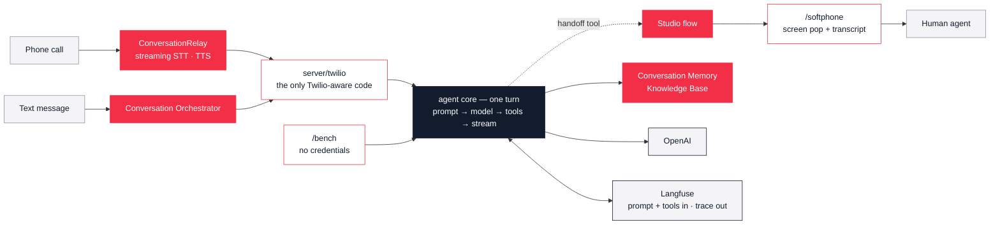

<div align="center">


**One AI agent, reachable by voice, SMS and a browser — with versioned prompts,
versioned tool selection, and every turn traced.**

[](https://nodejs.org)
[](https://nodejs.org/api/typescript.html)
[](https://www.twilio.com/docs)
[](https://langfuse.com)
[](ARCHITECTURE.md#proof-not-claims)

[What it shows](#what-it-shows) · [Capabilities](#capabilities) ·
[How it fits together](#how-it-fits-together) · [Architecture](ARCHITECTURE.md) ·
[Deploy](DEPLOY.md) · [Deep record](docs/HANDOFF.md)

</div>

---

A clonable starting point for customer-facing Twilio demos. The agent answers a phone call, answers a
text, remembers the caller between conversations, searches a knowledge base, and hands the call to a
human when asked — all from one channel-agnostic core.

The interesting part is not that it works. It is **what is wired up around it**: the three things
mature implementations have and proofs-of-concept never do.

> [!IMPORTANT]
> **This is a demo scaffold, not a production service.** It is built for the "art of the possible"
> conversation. It degrades loudly rather than failing safely, several endpoints are unauthenticated,
> and it assumes one process holds conversation state in memory. Those are choices —
> [`docs/HANDOFF.md`](docs/HANDOFF.md) names each one under "Gaps and honest limits".

## What it shows

### 1. Telemetry you can argue with

Every turn is a Langfuse trace: prompt fetch, tool selection, the model call, each tool execution,
first-token latency. A voice trace is **tiled** — `turn.voice` covers prompt-received → last-token-sent,
`caller.turn` covers every instant between two turns, and the two alternate with 0 ms of gap. So "the
demo felt slow" becomes a waterfall, and "is it us or the model?" is one attribute
(`gen_ai.client.operation.time_to_first_chunk`) rather than an investigation.

Measured across 33 generations: the framework costs **84 ms**. Everything else is model time.

### 2. Prompts that ship without a deploy

Prompts, and the model + tool list that go with them, live in Langfuse. Changing the agent's behaviour
is a prompt revision labelled `production`, live in about 20 seconds, with no redeploy and no code
review. When Langfuse is unreachable the compiled-in defaults take over and honestly report their
version as `fallback`, so a degraded demo is visible rather than silently different.

### 3. Tool selection as data

Which tools the agent has — and how each one is *described*, which is the part that actually decides
whether the model calls it — is versioned alongside the prompt, resolved through a three-way resolver
against a compiled-in catalog. Tool descriptions turn out to be load-bearing: one long description is
the difference between the knowledge base being used and being ignored.

### 4. A core that provably does not know about Twilio

`/bench` streams a complete agent turn in the browser with **no Twilio credentials at all**. That is not
a claim about import strings — the Twilio SDK and `twilio-agent-connect` may only be imported from
`server/twilio/`, a rule a test enforces, so the bench is a *runtime* proof that voice, SMS and the
browser are three adapters over one agent.

## Capabilities

| | |
|---|---|
| **Voice** | Inbound calls over ConversationRelay — streaming STT/TTS, barge-in on real audio, and the agent can hang up by itself |
| **SMS** | Inbound texts through Conversation Orchestrator, answered by the same agent code |
| **Memory** | Conversation Memory across *separate* conversations — a fact from last week comes back with zero tool calls |
| **Knowledge** | `search_knowledge` against a real Twilio Knowledge Base, on both channels |
| **Human handoff** | The caller asks for a person; the call transfers to a browser softphone with a screen pop carrying the reason and the transcript so far |
| **Observability** | Every turn is a Langfuse trace, with a live SSE feed of the same events at `GET /events/stream` |
| **Versioned prompts** | Prompt + model + tool list in Langfuse, with compiled-in fallback |
| **Twilio-free bench** | A full streaming turn in a browser with no credentials |

Six tools ship with it: `lookup_order`, `get_store_hours`, `end_call`, `retrieve_profile_memory`,
`search_knowledge`, `handoff`. The first two are credential-free fakes, so the demo is interesting
before any Twilio setup exists.

## How it fits together



Voice, SMS and the browser are three adapters over **one** `runTurn`. Everything channel-specific — how
audio arrives, how a reply is delivered, how a call ends — stays in `server/twilio/`, and the core cannot
import it.

**→ [ARCHITECTURE.md](ARCHITECTURE.md)** has the request path in detail, the capability matrix, the source
layout, the five boundaries enforced by tests, and what a trace actually contains.

## Running it

Infrastructure it needs, in full:

- **Node 24+** and **pnpm 11**. Node runs the TypeScript directly — there is no build step for the agent.
- An **OpenAI API key**. That alone gets you a working agent and the browser bench.
- **Docker**, only for the self-hosted Langfuse stack or to run the two services as containers.
- A **public HTTPS host**, only for inbound calls and texts. A tunnel, a reverse proxy, or a hosted URL —
  the scaffold does not care which, but three places have to agree on it.

```bash
pnpm install
cp .env.example .env    # then read it — it documents what each variable costs
pnpm dev:all            # agent :8910 + web :3000
```

**→ [DEPLOY.md](DEPLOY.md)** is the operator's guide: configuration, both run modes, containers behind a
reverse proxy, wiring the Twilio side, the seed scripts, the diagnostics, and the handful of mistakes
that produce a green-looking stack and a silent phone call.

## Learn more

| | |
|---|---|
| [**ARCHITECTURE.md**](ARCHITECTURE.md) | The moving parts: request path, capability matrix, source layout, the boundaries tests enforce, trace anatomy |
| [**DEPLOY.md**](DEPLOY.md) | Run it, containerise it, point real phone traffic at it |
| [**docs/HANDOFF.md**](docs/HANDOFF.md) | The deep record: what was built and *measured* task by task, where reality contradicted the plan, the latency waterfall, and the honest limits |
| [**`.env.example`**](.env.example) | The real configuration documentation — every entry says what breaks when it is absent |
| [**CLAUDE.md**](CLAUDE.md) | What an AI coding agent needs before changing anything here |

`docs/HANDOFF.md` is long, and that is the point: most of it is findings that cost real time to
discover once.
